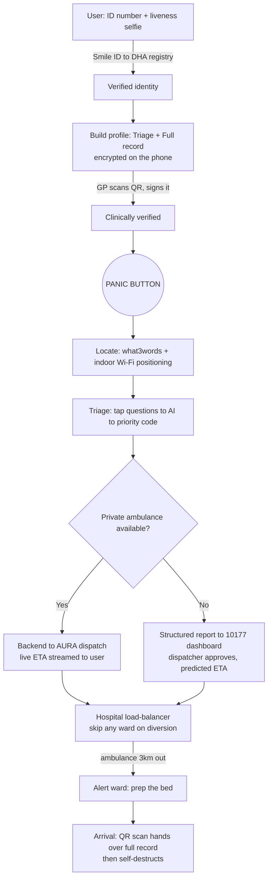

# Healthline: Emergency Medical Dispatch for South Africa

A citizen-facing app that ties every emergency request to a government-verified identity, carries a paramedic-ready medical profile, pinpoints the patient even where GPS fails, and routes the call to the fastest available responder, private or public.

Think an "Uber" service re-engineered for South African realities: a split public/private ambulance system, informal settlements with no street addresses, GPS that dies indoors, and hospitals that turn ambulances away when they are full.

---

## Executive Summary

**Current state.** South Africa's EMS runs as two disconnected tiers, public and private, with the public side short roughly 2,000 ambulances and reaching only 28% of urban calls in time, while patients go unfound, ambulances arrive blind, and prank calls clog the system.
 
**Goal state.** We want a trust-and-routing layer that verifies the requester, gives responders a verified medical summary, locates the patient anywhere, dispatches the closest ambulance, and pre-warms the right hospital.
 
**Constraints.** Government ambulances can't be dispatched by software, POPIA keeps medical data on-device, hospitals have no integration point, GPS fails indoors and in settlements, and abuse must be blocked at identity check.
 
**Solution.** One orchestration app that verifies identity, carries a doctor-signed profile, resolves location in two layers, routes across private or public EMS, and hands off records by scan, built on tools South Africa already has.

---

## How It Works

Two phases: a one-time **setup**, then the **emergency loop**.

### Setup (done once)

1. **Verify identity.** The user enters their 13-digit ID number and takes a *liveness selfie*, a selfie that proves a live person is present rather than a held-up photo. This is checked against the **Department of Home Affairs (DHA)**, the national identity registry, using **Smile ID** (the same identity-check service South African banks use).
2. **Build the medical profile as two payloads.** The app stores two encrypted records **on the phone itself**:
   * **Triage payload** (the only thing sent to an ambulance): blood type, severe allergies, critical medications, major chronic conditions. Just enough to keep someone alive in the back of a van.
   * **Full health record** (stays on the phone until the hospital): surgeries, family history, GP, next of kin.
3. **Get it doctor-signed** (optional but recommended). The user shows a **QR code** (the square barcode you scan with a phone) at their GP or clinic. A doctor whose **Health Professions Council of South Africa (HPCSA)** registration number checks out reviews the data and cryptographically signs it, so a paramedic later sees a **green "verified" checkmark** and treats without hesitation.

### Emergency (the loop)

4. **Panic.** The user hits the button.
5. **Locate.** Two layers run together: **what3words** (works offline, for areas with no street names) and an **Indoor Positioning System (IPS)** that uses Wi-Fi signals to find the exact floor and room where GPS can't reach.
6. **Triage.** A few rapid tap questions (*Unconscious? Breathing?*) feed an AI service that converts them into a standard priority code (e.g. *Code Red, Respiratory Arrest*), cutting the panicked-caller guesswork.
7. **Route.**
   * **Private path:** the backend calls **AURA**, a national aggregator that already unifies the private ambulance fleets behind one connection, which dispatches the nearest vetted ambulance and streams its live location back as an Uber-style estimated time of arrival (ETA).
   * **Public fallback:** a clean, structured report is sent to a `10177` dispatcher's dashboard; the dispatcher just clicks **Approve**, skipping the roughly 4-minute phone interview. The user sees a *predicted* ETA based on that suburb's history.
8. **Load-balance the hospital.** The system checks which nearby hospitals are *accepting* (not on diversion) and routes there. When the ambulance is 3km out, it alerts the ward to **prep the bed about 5 minutes early**.
9. **Handoff.** At the hospital, the patient's phone shows a **time-limited QR code**; the admitting doctor scans it and the full health record transfers straight into their browser, then self-destructs. No integration with hospital servers required.

### Flow diagram



---

## Tech Stack

The languages split cleanly by job: **React** owns the experience, **Java** owns the plumbing, **Python** owns the AI.

| Layer | Technology | Plain-English role |
|---|---|---|
| **Frontend** | React (web) plus mobile app; Mapbox GL maps; what3words and IPS SDKs | Everything the user, doctor, dispatcher, and ward clerk see |
| **On-device store** | SQLite (a small database that lives on the phone) with AES-256 encryption (bank-grade scrambling) | Keeps medical data private and off any central server |
| **Gateway and core services** | Java (Spring Boot) | The switchboard: auth, dispatch orchestration, routing, incoming webhooks |
| **Live updates** | WebSocket / STOMP (an always-open connection for streaming) | Pushes the ambulance's moving location to the user in real time |
| **AI triage** | Python (FastAPI) wrapping a Large Language Model (LLM), the kind of AI behind ChatGPT | Turns tap-answers into a clean clinical priority code |
| **Spatial database** | PostgreSQL with PostGIS (a database that answers "what's nearest?") | Finds the closest available hospital |
| **Live scratchpad** | Redis (an ultra-fast in-memory store) | Tracks which hospitals are open versus on diversion |
| **Identity check** | Smile ID into the DHA registry | Confirms the person is real |
| **Private dispatch** | AURA aggregator (one connection to all private fleets) | Sends the nearest ambulance |
| **Public handoff** | Digitised ProQA (a standard medical-priority questionnaire) | Structured report for the `10177` control room |
| **Application Programming Interface (API)** | REST plus webhooks throughout | How these systems talk to each other; a *webhook* lets AURA push updates the moment they happen |

---

## Quick Start

**Prerequisites:** Docker · Python 3.13 · (optional) JDK 21 + Maven — Docker substitutes for
these if you don't have them installed locally.

### Run it locally

```bash
docker compose up --build
```

Starts all three containers together — `backend` on `:8080`, `ai-service` on `:8000`, plus a
throwaway local `postgres` — wired to each other automatically. Verify:

```bash
curl http://localhost:8080/health

curl -X POST http://localhost:8080/api/emergency/trigger \
  -H "Content-Type: application/json" \
  -d '{"triagePayload":{"age":21,"bloodType":"AB+","allergies":["Penicillin"],"medications":[],"chronicConditions":[],"specialNeeds":[]},"location":{"plusCode":null}}'
```

Returns a `201` with a `dispatchId` — poll `GET /api/emergency/<dispatchId>`: `PENDING`
immediately, `DISPATCHED` with a real AI-generated summary after ~5s (since `ai-service` is
reachable via compose).

`.env.example` documents the env vars Render's dashboard sets in production — not needed for
the compose path above.

### Build and test each service in isolation

**Backend** (`backend/`, Spring Boot):
```bash
cd backend
mvn verify                                                              # with local JDK 21
docker run --rm -v "$(pwd):/app" -w /app maven:3.9-eclipse-temurin-21 mvn verify   # without
```

**AI service** (`ai-service/`, FastAPI):
```bash
cd ai-service
python -m venv .venv && .venv/Scripts/activate    # .venv/bin/activate on macOS/Linux
pip install -r requirements-dev.txt
python -m pytest tests/ -v
uvicorn app.main:app --reload                      # → http://localhost:8000/health
```

Windows Git Bash: if a `docker run -v` command errors on the path, prefix it with
`MSYS_NO_PATHCONV=1`.

---

## Impact

Who it helps, and how it is measured:

* **Patients** get help that arrives faster and goes to the right hospital, with their history already in the room.
* **Paramedics** arrive knowing blood type, allergies, and medications, doctor-verified, so no one treats blind.
* **Hospitals** stop receiving ambulances they can't take, and prep beds before arrival.
* **Public dispatchers** approve accurate, pre-structured reports instead of untangling panicked phone calls.

Targeted, measurable outcomes: shorter time-to-dispatch, fewer wrong-hospital diversions, lower over-triage, and zero anonymous prank calls, all without buying a single ambulance or replacing any government system.
